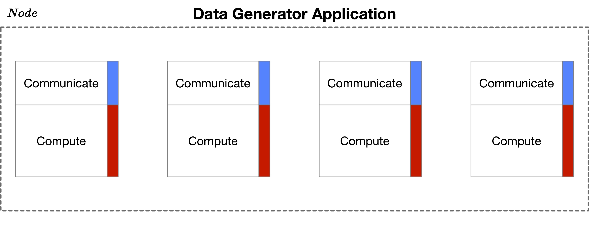
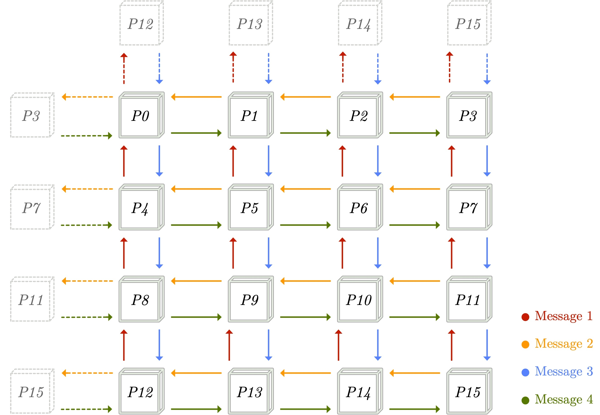

The _Data Generator Application_ is a stencil application used for data collection.
Schematically, an instance of this application being executed on a computing node with four processes can be seen bellow:

Where, the _Compute_ phase can be either Compute or Memory Bound, and the 
_Communicate_ phase is described by the following figure (for an example with more processes):

As is clear from the above, this application has a number of configurable parameters.
The implementations for both of these phases are included in
[StencilBenchmark.c](StencilBenchmark.c), whereas the complete application that implements the above stencil of the two 
phases is included in [main.c](main.c).
The rest of the files are either utility/helper scripts and functions that were used when building the 
application and for data collection.  
