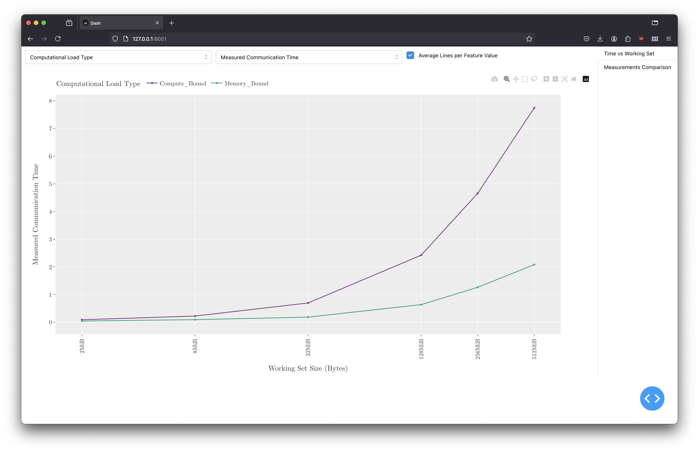

Both the data analysis and the modeling of the execution of the [Data Generator Application](../DataGeneratorApplication)
required thorough examinations and experimentation.
To that end, an auxiliary web-based application with configurable plots was created.
This application (included in [main.py](main.py)) has two main tabs, tailored to 
the data produced by the Data Generator Application.

The first tab can display the various measured times against the working-set size, with the ability to average
all the data-points that share a feature value, as show in the examples bellow:

The second tab includes a comparison between the measured and model predicted times.
They were of great use for choosing and tuning models.

These plots helped during the analysis of the different scenarios, and offered several insights into the factors that 
affected performance.
They were also a great intermediate tool for finding useful plots to use in the full thesis document. 